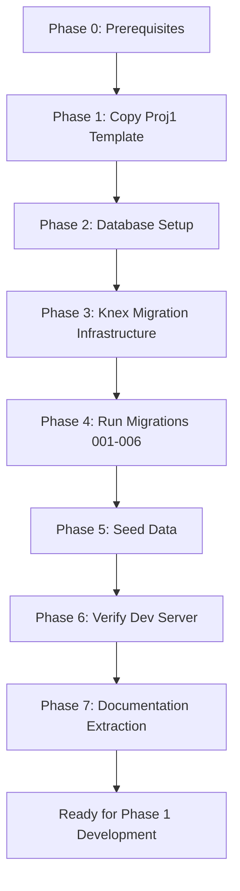

# VSP — Getting Started Guide

> **Purpose:** This is the step-by-step execution guide for bootstrapping the VSP project from the Proj1 template. Follow this sequence exactly.

---

## Phase 0 — Prerequisites

Before starting, ensure these are installed on your dev machine:

| Tool | Version | Check Command |
|---|---|---|
| Node.js | ≥18.x | `node -v` |
| npm | ≥9.x | `npm -v` |
| MySQL | 8.x | `mysql --version` |
| Redis | 7.x | `redis-cli ping` → `PONG` |
| Git | Any | `git --version` |

---

## Phase 1 — Project Extraction (Copy Proj1 Template)

### Step 1.1 — Copy the template

```powershell
# From your workspace root
xcopy "D:\Node\Proj1\*" "D:\Node\VSP\" /E /I /H /Y /EXCLUDE:exclude.txt
```

**What to copy:**
- [x] `server/` (entire directory, minus `node_modules/`)
- [x] `client/` (entire directory, minus `node_modules/` and `build/`)
- [x] `package.json` (root)
- [x] `.gitignore`
- [x] `start-dev.bat`

**What NOT to copy:**
- `node_modules/` (will be reinstalled)
- `client/build/` (will be regenerated)
- `dump.rdb` (Redis dump)
- `server/schema_inspect.txt` (Proj1-specific)
- `server/scratch_*`, `server/check_*`, `server/fix_*`, `server/debug_*` (scratch scripts)
- `others/` (VSP has its own)

### Step 1.2 — Clean up template artifacts

After copying, remove Proj1-specific demo pages and placeholder content:

```
DELETE these demo page files (client/src/pages/admin/):
├── Table.js, TableFilters.js, TableTab.js
├── TableParent.js, TableMultiple.js, TableCheckbox.js, TableDataGrid.js
├── Buttons.js, Pagelet.js, Icons.js
├── Loading.js, Notifications.js, Tooltips.js
├── FormLayouts.js, FormValidations.js, FormVariations.js
├── Charts.js, Pending.js
```

> [!NOTE]
> Keep `Dashboard.js`, `Users.js`, `Profile.js`, `Settings.js` — these are functional pages that will be extended.

### Step 1.3 — Update project identity

**Root `package.json`:**
```json
{
  "name": "vsp",
  "description": "VSP Workforce Management Platform"
}
```

**Server `package.json`:**
```json
{
  "name": "vsp-server",
  "description": "VSP Backend API"
}
```

### Step 1.4 — Install dependencies

```powershell
# Root
cd D:\Node\VSP
npm install

# Server
cd server
npm install

# Client
cd ../client
npm install
```

---

## Phase 2 — Database Setup

### Step 2.1 — Create the MySQL database

```sql
-- Connect to MySQL
mysql -u root -p

-- Create database
CREATE DATABASE vsp CHARACTER SET utf8mb4 COLLATE utf8mb4_unicode_ci;

-- Verify
SHOW DATABASES LIKE 'vsp';
```

### Step 2.2 — Configure environment

Update `server/.env`:

```env
NODE_ENV=development
PORT=5000
REDIS_PREFIX=vsp_

CLIENT_URL=http://localhost:3000

# Database — MySQL for development
DB_CLIENT=mysql

DB_HOST_MYSQL=localhost
DB_PORT_MYSQL=3306
DB_USER_MYSQL=root
DB_PASSWORD_MYSQL=sa
DB_NAME_MYSQL=vsp

# PostgreSQL config (for future production)
DB_HOST_PG=localhost
DB_PORT_PG=5432
DB_USER_PG=postgres
DB_PASSWORD_PG=sa
DB_NAME_PG=vsp

PHOTO_STORAGE_PATH=../private_storage

# Email (update with real credentials later)
EMAIL_USER=emailsystem.ino@gmail.com
EMAIL_PASS=your_app_password
EMAIL_HOST=smtp.gmail.com
EMAIL_PORT=587

# Security — REGENERATE THESE for VSP
JWT_SECRET=<generate-new-256bit-key>
JWT_EXPIRES_IN=1d
COOKIE_SECURE=true
COOKIE_SAME_SITE=Strict
COOKIE_SECRET=<generate-new-256bit-key>

DB_POOL_MIN=2
DB_POOL_MAX=15
UV_THREADPOOL_SIZE=8
```

> [!WARNING]
> **Generate new JWT and Cookie secrets.** Do not reuse Proj1 keys. Use:
> ```powershell
> node -e "console.log(require('crypto').randomBytes(32).toString('base64'))"
> ```

### Step 2.3 — Create storage directory

```powershell
mkdir "D:\Node\VSP\private_storage"
mkdir "D:\Node\VSP\private_storage\media"
```

---

## Phase 3 — Knex Migration Infrastructure

### Step 3.1 — Initialize Knex migrations

```powershell
cd D:\Node\VSP\server
npx knex init
```

This creates `knexfile.js`. Update it:

```js
// server/knexfile.js
require('dotenv').config();

module.exports = {
  development: {
    client: 'mysql2',
    connection: {
      host: process.env.DB_HOST_MYSQL,
      port: process.env.DB_PORT_MYSQL,
      user: process.env.DB_USER_MYSQL,
      password: process.env.DB_PASSWORD_MYSQL,
      database: process.env.DB_NAME_MYSQL,
    },
    migrations: { directory: './migrations' },
    seeds: { directory: './seeds' },
  },
  production: {
    client: 'pg',
    connection: {
      host: process.env.DB_HOST_PG,
      port: process.env.DB_PORT_PG,
      user: process.env.DB_USER_PG,
      password: process.env.DB_PASSWORD_PG,
      database: process.env.DB_NAME_PG,
    },
    migrations: { directory: './migrations' },
    seeds: { directory: './seeds' },
  }
};
```

### Step 3.2 — Create shared audit column helper

Create `server/migrations/_helpers.js`:

```js
/**
 * Adds the standard audit columns to every table.
 * Called inside every migration's createTable callback.
 *
 * Columns added:
 *   tenant_id, inactive, archived, changelog,
 *   created_at, updated_at, created_by,
 *   deleted_at, deleted_by, archived_at, archived_by
 */
function addAuditColumns(table, knex) {
  table.integer('tenant_id').notNullable().defaultTo(1).index();
  table.tinyint('inactive').notNullable().defaultTo(0).index();
  table.tinyint('archived').notNullable().defaultTo(0);
  table.json('changelog').nullable().defaultTo(null);
  table.timestamp('created_at').defaultTo(knex.fn.now());
  table.timestamp('updated_at').defaultTo(knex.fn.now());
  table.integer('created_by').unsigned().nullable();
  table.timestamp('deleted_at').nullable().defaultTo(null);
  table.integer('deleted_by').unsigned().nullable();
  table.timestamp('archived_at').nullable().defaultTo(null);
  table.integer('archived_by').unsigned().nullable();
}

module.exports = { addAuditColumns };
```

**Usage in any migration:**
```js
const { addAuditColumns } = require('./_helpers');

exports.up = function(knex) {
  return knex.schema.createTable('my_table', (table) => {
    table.increments('id').primary();
    // ... domain columns ...
    addAuditColumns(table, knex);  // Always last
  });
};
```

### Step 3.3 — Create migration directories

```powershell
mkdir "D:\Node\VSP\server\migrations"
mkdir "D:\Node\VSP\server\seeds"
```

---

## Phase 4 — Database Migrations (Execution Order)

Run these migrations in sequence. Each migration depends on the previous one.

### Migration 1: Core tables (existing Proj1 tables)

```powershell
npx knex migrate:make 001_create_core_tables
```

**Tables created:**
- `users` — Admin users (with `un`, `pw`, `fn`, `mn`, `sn`, etc.)
- `employees` — Employee records (same column pattern)
- `clients` — Client company records
- `user_position` — Job positions/titles
- `settings` — App configuration key-value store
- `settings_pages` — Page-level settings

> [!NOTE]
> These tables mirror the existing Proj1 schema but are created fresh via Knex migrations instead of raw SQL. Add the audit columns via `addAuditColumns(table, knex)` to each.

---

### Migration 2: Tenant & RBAC tables

```powershell
npx knex migrate:make 002_create_tenant_rbac
```

**Tables created:**
- `tenants` — Multi-tenant registry
- `roles` — Role definitions (Super Admin, HR Admin, etc.)
- `permissions` — Module + action permissions
- `role_permissions` — Role-to-permission mapping
- `user_roles` — User-to-role assignment

---

### Migration 3: Client Management tables

```powershell
npx knex migrate:make 003_create_client_management
```

**Tables created:**
- `client_staff_assignments` — Employee-to-client assignments
- `client_contracts` — MSA, NDA, BAA, SOW documents
- `client_training_materials` — SOPs, training uploads
- `replacement_requests` — Staff replacement workflow

---

### Migration 4: Workforce Management tables

```powershell
npx knex migrate:make 004_create_workforce
```

**Tables created:**
- `employee_documents` — Resumes, IDs, certifications
- `employee_skills` — Skill inventory
- `bench_status` — Floating/available staff tracking
- `courses` — LMS course catalog
- `course_enrollments` — Employee course progress
- `payslips` — Salary records

---

### Migration 5: Operations tables

```powershell
npx knex migrate:make 005_create_operations
```

**Tables created:**
- `applicants` — Recruitment applicant records
- `recruitment_stages` — Pipeline stage tracking
- `announcements` — Company communications
- `announcement_acks` — Read receipts
- `compliance_records` — HIPAA, NDA, device compliance

---

### Migration 6: Finance & Time Tracking tables

```powershell
npx knex migrate:make 006_create_finance_time
```

**Tables created:**
- `invoices` — Client invoices
- `invoice_line_items` — Invoice detail lines
- `payments` — Stripe payment records
- `payroll_runs` — Payroll batch processing
- `disbursement_accounts` — Employee bank/wallet info
- `time_entries` — Hours worked (Hubstaff sync)
- `activity_logs` — Productivity snapshots
- `audit_logs` — System-wide audit trail
- `notifications` — Multi-channel notification queue

---

### Running migrations

```powershell
# Run all pending migrations
cd D:\Node\VSP\server
npx knex migrate:latest

# Check migration status
npx knex migrate:status

# Rollback last batch (if needed)
npx knex migrate:rollback
```

---

## Phase 5 — Seed Data

### Step 5.1 — Create seed files

```powershell
npx knex seed:make 01_tenants
npx knex seed:make 02_roles_permissions
npx knex seed:make 03_admin_user
npx knex seed:make 04_positions
npx knex seed:make 05_settings
```

### Step 5.2 — Essential seed data

**01_tenants:**
```js
{ id: 1, name: 'Virtual Staffing Philippines', slug: 'vsp', is_active: 1 }
```

**02_roles_permissions:** (see RBAC section of architecture plan)
```js
// Roles
{ code: '0-SA',  name: 'Super Admin' }
{ code: '0-HR',  name: 'HR Admin' }
{ code: '0-FIN', name: 'Finance Admin' }
{ code: '0-OPS', name: 'Operations Admin' }

// Permissions (per module)
{ module: 'workforce',   action: 'read' }
{ module: 'workforce',   action: 'write' }
{ module: 'billing',     action: 'read' }
{ module: 'billing',     action: 'write' }
{ module: 'recruitment', action: 'read' }
{ module: 'recruitment', action: 'write' }
// ... etc
```

**03_admin_user:**
```js
// Default super admin (password: changeme123)
{
  fn: 'Admin', sn: 'User', un: 'admin',
  pw: '<bcrypt-hash>', email: 'admin@vsp.com',
  tenant_id: 1
}
```

### Step 5.3 — Run seeds

```powershell
npx knex seed:run
```

---

## Phase 6 — Verify Development Server

### Step 6.1 — Start Redis

```powershell
# If using local Redis
cd D:\Node\VSP\redis
redis-server
```

### Step 6.2 — Start the dev server

```powershell
cd D:\Node\VSP
npm run dev
```

This starts both:
- **Server:** `http://localhost:5000` (Express API)
- **Client:** `http://localhost:3000` (React app)

### Step 6.3 — Verify checklist

| Check | Expected Result |
|---|---|
| Server starts without errors | `Server active on port 5000` in console |
| Database connects | No `DB Connection Failed` errors |
| Redis connects | No Redis connection errors |
| Client loads | React app at `http://localhost:3000` |
| Login works | Use seed admin credentials |
| API responds | `GET http://localhost:5000/api/web/settings` returns JSON |

---

## Phase 7 — Documentation Extraction

Set up the project documentation structure within `.agent/`:

### Step 7.1 — VSP `.agent` directory structure

```
D:\Node\VSP\.agent\
├── workflows/
│   └── instruction.md          # Development rules (extend from Proj1)
├── input validation.txt        # Validation system reference (already exists)
├── architecture.md             # Link/summary pointing to implementation plan
└── database/
    └── schema-reference.md     # Auto-generated from migrations
```

### Step 7.2 — Create VSP-specific instruction.md

Copy `D:\Node\Proj1\.agent\workflows\instruction.md` to `D:\Node\VSP\.agent\workflows\instruction.md`, then append VSP-specific rules:

```markdown
## VSP-Specific Rules (Additions)

### Database
1. All new tables MUST include the standard audit columns via `addAuditColumns()` helper.
2. All queries MUST include `tenant_id` filtering via middleware.
3. Use Knex query builder exclusively — no raw SQL unless dialect-specific logic is required.
4. Use Knex `.raw()` with dialect-aware operators when raw SQL is unavoidable.

### API
1. All new routes MUST be under `/api/v1/` namespace.
2. Domain-specific routes go in `server/routes/domain/`.
3. Generic CRUD entities use the existing `ResourceModel` + dynamic registration pattern.

### Security
1. All domain controllers handling sensitive data MUST include audit logging.
2. Encrypted fields (e.g., bank details) use Node.js `crypto` module with AES-256.

### Frontend
1. New domain pages go under `client/src/pages/{admin|client|employee}/{domain}/`.
2. Reusable domain components go in `client/src/components/domain/{domain}/`.
```

### Step 7.3 — Create architecture reference

Create `D:\Node\VSP\.agent\architecture.md`:

```markdown
# VSP Architecture Reference

Full system architecture document: see implementation plan artifact.

## Quick Links
- **Structure Requirements:** `others/Structure.txt`
- **Getting Started:** (this document)
- **Database Migrations:** `server/migrations/`
- **Development Rules:** `.agent/workflows/instruction.md`
- **Validation System:** `.agent/input validation.txt`
```

### Step 7.4 — Generate schema reference (after migrations)

After running migrations, auto-generate a schema reference:

```powershell
cd D:\Node\VSP\server
node -e "
  const db = require('./config/db');
  db.raw('SHOW TABLES').then(([tables]) => {
    console.log('Tables:', tables.map(t => Object.values(t)[0]));
    process.exit();
  });
"
```

---

## Execution Summary



| Phase | Estimated Time | Dependencies |
|---|---|---|
| Phase 0 — Prerequisites | 10 min | None |
| Phase 1 — Project Extraction | 15 min | Phase 0 |
| Phase 2 — Database Setup | 10 min | Phase 0 |
| Phase 3 — Knex Infrastructure | 15 min | Phase 1 |
| Phase 4 — Migrations | 30 min | Phase 2, 3 |
| Phase 5 — Seed Data | 15 min | Phase 4 |
| Phase 6 — Verify Server | 5 min | Phase 5 |
| Phase 7 — Documentation | 15 min | Phase 1 |
| **Total** | **~2 hours** | |

---

> [!IMPORTANT]
> After completing all phases, the VSP project will have a fully functional development environment with the database schema, seed data, and documentation structure in place. You can then proceed to **Phase 1 of the MVP Roadmap** (RBAC middleware, employee/client profile extensions, dashboard shells).
